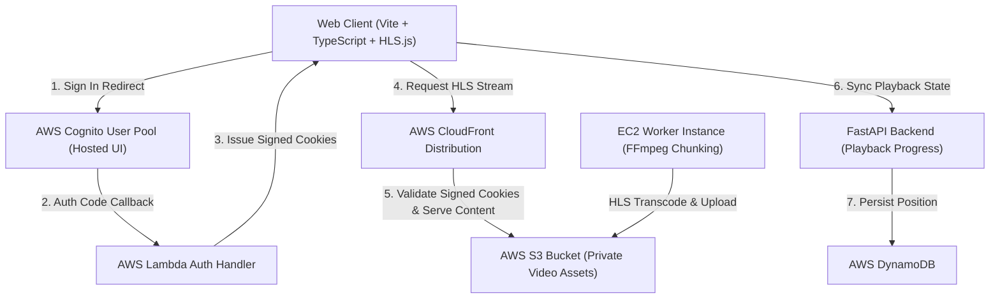

# StreamVault

An end-to-end, enterprise streaming platform for chunking, securing, and streaming high-definition video over HTTP Live Streaming (HLS). Powered by **AWS CloudFront Signed Cookies**, **AWS Cognito**, **AWS Lambda**, **FFmpeg**, and a **Glassmorphic Web UI**.

---

## Key Features

- **Token-Gated HLS Streaming**: Full security for `.m3u8` playlists and `.ts` media segments using CloudFront Signed Cookies (`SameSite=Lax`).
- **Automated On-Demand EC2 Pipeline**: Parallel FFmpeg encoding workers launched on EC2 (`c7i.2xlarge`) for fast video chunking.
- **Multi-Audio & Subtitle Support**: Dynamic audio track switching (Hindi, English, Telugu, Tamil, Malayalam, Kannada) and WebVTT subtitle selection inside `Hls.js`.
- **Netflix-Style Glassmorphic UI**: 16:10 poster aspect ratio, vignette overlays, real-time debounced search, and responsive layout.
- **Continue Watching Progress**: Persistent watch state synchronized across client `LocalStorage` and AWS DynamoDB.

---

## System Architecture



---

## Quick Start & Local Development

### Prerequisites

- **Node.js** v20+ and **pnpm**
- **AWS CLI** configured with appropriate permissions
- **FFmpeg** installed locally (for local chunking tests)

### Installation

```bash
# Clone the repository
git clone https://github.com/pshah-lab/StreamVault.git
cd StreamVault

# Install dependencies across workspace
pnpm install
```

### Local Build Checks

```bash
pnpm build:web
pnpm build:infra
```

---

## Deployment & Pipeline Usage

### 1. Deploy Infrastructure (AWS CDK)

```bash
# Generate local signing key pair
bash infra/scripts/create-cloudfront-key-pair.sh

# Deploy CDK Stack
pnpm --dir infra cdk bootstrap aws://YOUR_ACCOUNT_ID/YOUR_AWS_REGION
pnpm --dir infra cdk deploy \
  --parameters CognitoDomainPrefix=YOUR_COGNITO_DOMAIN_PREFIX \
  --parameters CloudFrontPublicKeyPem="$(cat .secrets/cloudfront/public.pem)"
```

### 2. Deploy Web Viewer

```bash
pnpm deploy:web
```

This command automatically builds the web app (`web/dist`), syncs assets to `s3://YOUR_BUCKET_NAME/app/`, and invalidates the CloudFront cache.

---

## Automated End-to-End Pipeline

Process raw `.mp4`, `.mkv`, or `.mov` files from raw input to live streaming in a single command:

```bash
# Drop video files into input/ directory
pnpm pipeline
```

| Step | Action |
|------|--------|
| **1. Scan** | Detects new video files in `input/` |
| **2. Metadata** | Prompts for title, subtitle, year, and HLS name |
| **3. Upload** | Uploads raw source file to `s3://YOUR_BUCKET_NAME/input/` |
| **4. EC2 Chunking** | Launches an on-demand EC2 worker for FFmpeg transcoding |
| **5. S3 Sync** | Uploads multi-audio HLS playlists and segments to `output/` |
| **6. Catalog & Deploy** | Updates `movies.json` and deploys web viewer |

---

## Inviting Viewers

Create invite-only viewer accounts using AWS Cognito:

```bash
aws cognito-idp admin-create-user \
  --user-pool-id YOUR_USER_POOL_ID \
  --username viewer@example.com \
  --user-attributes Name=email,Value=viewer@example.com Name=email_verified,Value=true \
  --desired-delivery-mediums EMAIL
```

---

## License

MIT License. See [LICENSE](LICENSE) for details.
